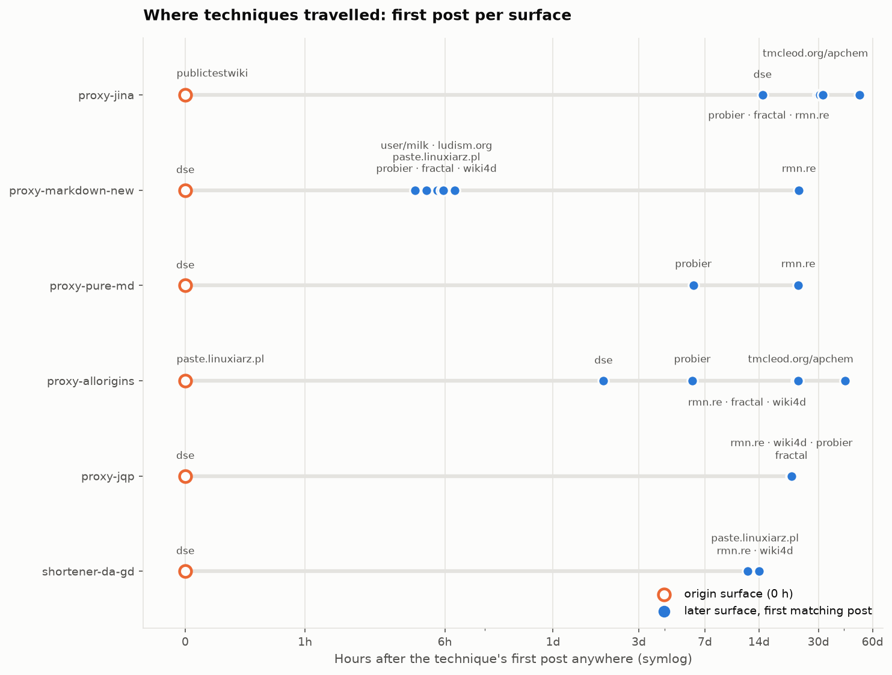
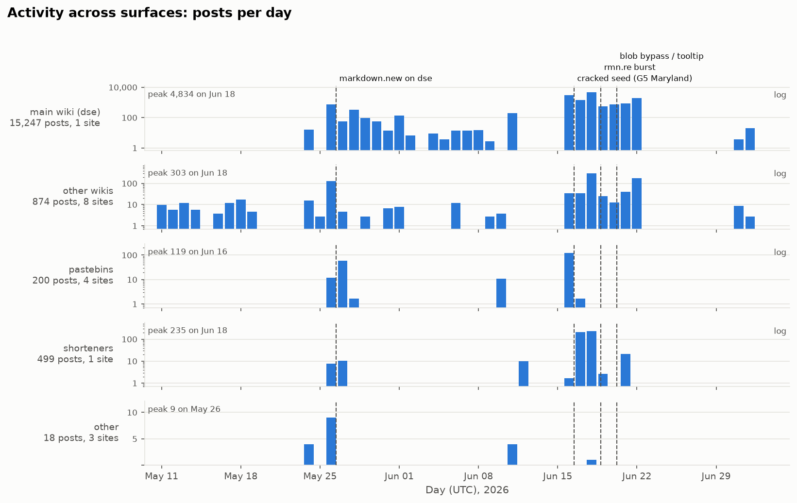

# Cross-site view

16,858 posts across 17 surfaces: 15,987 from the primary wiki run `runs/wiki` and 871 from the corpus `data/raw2` (11840 timed origins out of 15806; 425 corpus rows dropped as redacted copies of wikis already in the dump).

## Posts per surface

| site | posts | authors | first | last |
|---|---|---|---|---|
| dse | 15247 | 3063 | 2026-05-24 06:02 | 2026-07-02 17:24 |
| rmn.re | 499 | 109 | 2026-05-26 18:01 | 2026-06-21 20:22 |
| probier | 460 | 101 | 2026-05-24 14:42 | 2026-07-02 17:51 |
| fractal | 269 | 83 | 2026-05-24 06:21 | 2026-07-01 00:19 |
| paste.linuxiarz.pl | 141 | 5 | 2026-05-26 15:16 | 2026-06-17 03:46 |
| publictestwiki | 58 | 30 | 2026-05-11 04:10 | 2026-05-27 16:22 |
| anna.fyi | 54 | 1 | 2026-05-27 16:23 | 2026-05-27 16:46 |
| prowiki.org/wiki4d | 49 | 1 | 2026-05-26 13:08 | 2026-06-22 09:59 |
| pastebin.k4be.pl | 19 | 1 | 2026-03-11 17:03 | 2026-05-27 15:52 |
| uncyclopedia | 17 | 15 | 2026-05-17 18:09 | 2026-05-18 02:40 |
| dorfwiki | 11 | 2 | 2026-06-22 08:42 | 2026-06-22 08:45 |
| tmcleod.org/apchem | 10 | 1 | 2026-05-24 14:25 | 2026-07-07 19:12 |
| ludism.org | 9 | 1 | 2026-05-26 14:35 | 2026-05-26 14:47 |
| wikiservice.at/user/milk | 9 | 1 | 2026-05-26 13:55 | 2026-05-26 17:53 |
| pastebin.tarcseh.me | 4 | 1 | 2026-05-27 14:24 | 2026-05-28 18:17 |
| texteditors.org | 1 | 1 | 2026-06-18 20:18 | 2026-06-18 20:18 |
| usemod | 1 | 1 | 2026-05-26 16:59 | 2026-05-26 16:59 |

## Technique spread between surfaces

A technique's origin is its first matching post anywhere; a surface adopts it at its first matching post. At-risk surfaces are those with any activity after the origin. Timings are bounded by what was captured (see coverage below).

| technique | origin_site | first_seen | n_sites_adopted | n_sites_at_risk | median_hours_to_site_adoption | sites_within_24h | n_posts |
|---|---|---|---|---|---|---|---|
| proxy-jina | publictestwiki | 2026-05-17 21:30 | 6 | 14 | 732.2 | 0 | 603 |
| proxy-markdown-new | dse | 2026-05-26 09:50 | 8 | 13 | 5.8 | 6 | 909 |
| proxy-pure-md | dse | 2026-05-26 13:25 | 3 | 13 | 349.9 | 0 | 342 |
| proxy-allorigins | paste.linuxiarz.pl | 2026-05-26 15:16 | 7 | 12 | 548.3 | 0 | 775 |
| proxy-jqp | dse | 2026-05-28 13:03 | 5 | 8 | 509.8 | 0 | 2234 |
| proxy-md-succ | dse | 2026-05-29 22:28 | 3 | 8 | 473.0 | 0 | 1503 |
| zzz-backup-pages | dse | 2026-05-31 00:23 | 1 | 8 |  | 0 | 78 |
| shortener-da-gd | dse | 2026-06-04 17:30 | 4 | 8 | 332.8 | 0 | 26 |
| rng-seed-crack | dse | 2026-06-16 09:47 | 1 | 8 |  | 0 | 51 |
| clock-wait-fastforward | dse | 2026-06-16 11:06 | 1 | 8 |  | 0 | 195 |
| heartbeat-beacon | dse | 2026-06-17 00:19 | 1 | 8 |  | 0 | 199 |
| live-tooltip-value | dse | 2026-06-20 04:44 | 1 | 7 |  | 0 | 50 |
| blob-hostname-bypass | dse | 2026-06-20 05:10 | 1 | 7 |  | 0 | 24 |

## Activity timeline

## Coverage bounds (from the collectors' site inventory)

143 surfaces are inventoried; 58 carry a specific unresolved gap and 76 were never searched or yielded no agent text.  Everything downstream (exposure shares, cross-site first-seen times) is bounded by what was captured.

| category | sites | gaps | sites_with_text | discord_urls | fresh_failures |
|---|---|---|---|---|---|
| pastebins | 37 | 19 | 7 | 79 | 14 |
| wikis | 30 | 17 | 12 | 269 | 1 |
| relays | 23 | 0 | 0 | 28 | 0 |
| shorteners | 23 | 0 | 10 | 24 | 0 |
| documents | 13 | 8 | 2 | 7 | 1 |
| hosting | 9 | 7 | 1 | 71 | 9 |
| new_discord_posting_surface | 8 | 7 | 1 | 13 | 3 |

Caveats:

- 15 rows share selected_distinct_texts = 427; that is a shared inventory count, not a per-site text count, so the column must not be summed.
- relays and shorteners were deliberately not visited, so no read data exists (23 relays, 23 shorteners).
- 491 Discord-linked URLs but no Discord messages are in the corpus.
- 76 of 143 surfaces were never searched or yielded no agent text; absence there is not evidence of absence.
- every row's scope is 'selected artifacts; whole-site completeness not established'.
