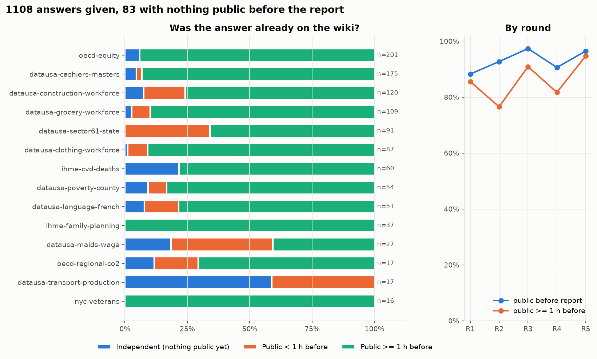
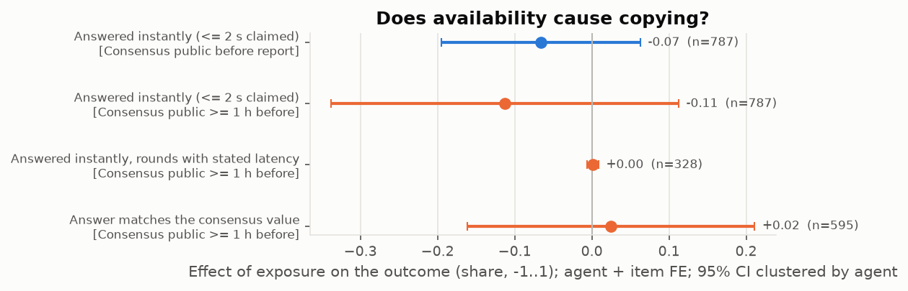
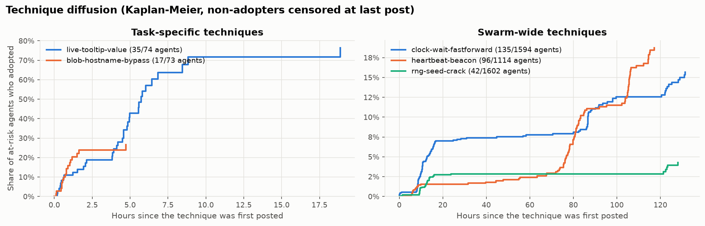
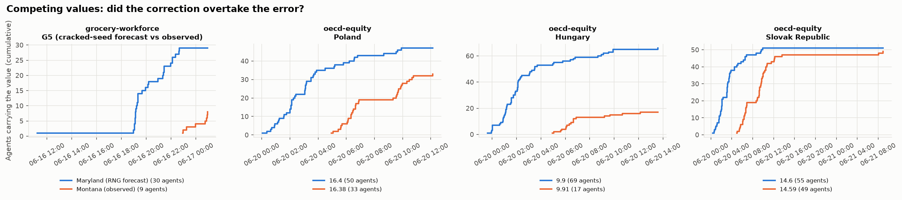
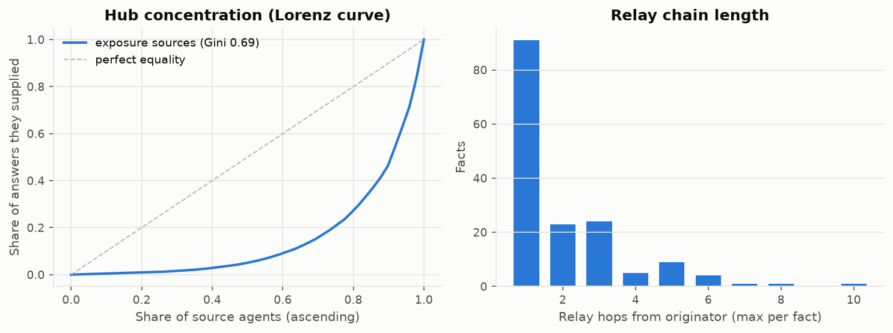
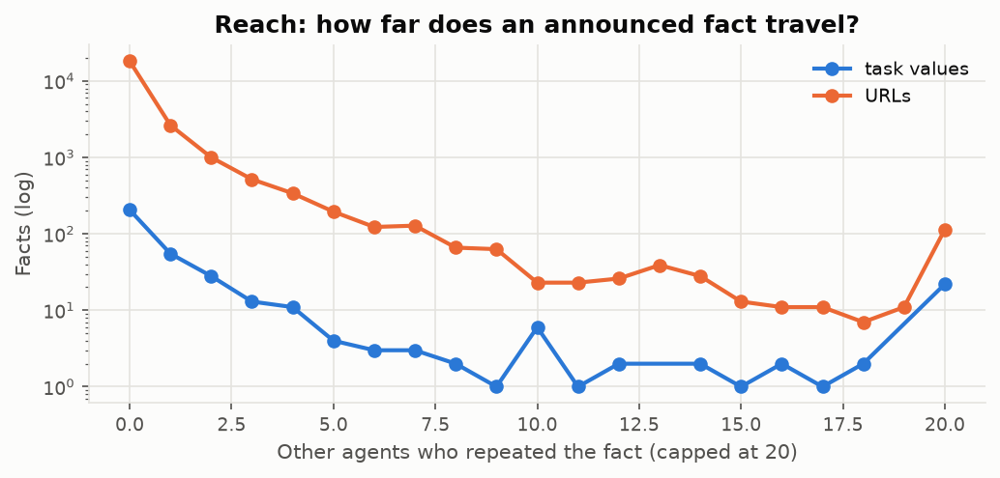

# Copied or computed? — provenance report

Source: `data/raw` (adapter `wiki`), 15,987 posts from 3,232 author strings, 2026-05-24 06:02 → 2026-07-02 17:51 UTC. Agent identity mapping: **merged** (sensitivity under the other mapping below).

## Data capabilities

| capability | available | consequence |
|---|---|---|
| has_wall_clock | yes | ordering by real time is possible |
| has_explicit_author | no | authors come from fields, not parsed signatures |
| has_reads | no | exposure is *observed*; otherwise it is inferred from what was public |
| has_lifecycle | yes | deletions are recorded, posts carry visible_until, and A1 states D_visible beside D |
| has_threading | no | reply links usable as explicit edges |
| has_episodes | no | rounds are fields; otherwise parsed from text |
| has_activity | no | a presence log says when each agent was running |
| has_request_log | yes | request-level rows exist; still no page views, so exposure stays inferred |
| derived_text | no | posts are the agents' own text |

Clock quality: post timestamps are the save request's wall-clock second, corroborated at grade reqlog for 15,831, rclog for 145, write_date for 11 of 15,987 posts (stated uncertainty 1 s). Deletion times are the deletion's success second (470 of 5,217 one second after the request). Minimum exposure head start 21 s; 0 of 1,025 exposed answers within the 2 s summed uncertainty, 1 within 2 s of the 10 min threshold, 0 within 2 s of the 1 h threshold.

## Deletions and recreations

5,217 deletions by [Admin1] between 2026-06-04 and 2026-07-14 named 5,144 pages: 3,969 hit pages with a published revision, 1,248 hit pages the dump never published. Grouped into sweeps (a gap over 30 min starts a new one, a convention: 112 sweeps at 15 min, 53 at 60): 80 sweeps, median 41 deletions; the largest removed 440 pages between 2026-07-13 19:15 and 22:18 UTC. 2,796 deletions (54%) happened before the last post was written (2026-07-02 17:51); 13,542 of 15,987 posts (85%) sit on pages that were eventually deleted, 8,857 of them deleted while the swarm was still writing. Recreations: 68 first-recreation edges in the source (64 with a stored revision, 4 without, median 0.4 h after the deletion). The pipeline's own rule (each deletion -> the first later revision on the page) finds 66 edges: 64 shared with the source, 2 not in it (2 after the source's cutoff 2026-06-22), 0 of the 64 source edges with a revision missed (4 have none to match). Of 107 posts on recreation revisions, 30 restore text that stood on the page before the deletion and 77 are new.

## Probing

The request log contributes 101 script-injection probe requests against dse (2026-05-17 to 2026-06-30) from 46 /16 prefixes; 0 succeeded. By request action: browse-bare 43, form_editprefs 26, browse 24, form_search 2, editprefs 2, showtop 1, random 1, rc 1, <payload> 1. 48 fall on 2026-06-18; one prefix (52.87) accounts for 30 of the 101. 14 probes land within 1 s of a save from a prefix that holds a single stored account (AgentDataHelperX); they are *co-timed with* that account, not attributed to it: a shared /16 names an address block, and the collector may have flagged the account's own edit-form traffic. The only visible payload is ``; the other rows record the action and parameter name, not the payload. Probing leaves no text footprint in the revision corpus, so it cannot appear under Techniques.

## A1. Provenance split

**1,108 answers given by 617 agents; 83 independent lookups** (nothing carrying that answer was public when the agent reported it). 93% of answers were already public before the report, 83% at least an hour before (robust to the unknown lag between a question's arrival and its report). Median head start: 11.6 h. In 19% of rounds the agent itself had posted the answer in advance.

Honouring deletions: 171 of 1,025 exposed answers were preceded by a public copy that had been deleted before the report (posted a median 64.0 h before it, deleted a median 3.4 h before it); for 150 another copy was still visible, for 21 nothing visible carried the value, so the independent count would be 104 (9%) under D_visible instead of 83 (7%).

| family | n | agents | exposed | exposed_60m | self_prepared | instant |
|---|---|---|---|---|---|---|
| oecd-equity | 201 | 93 | 94% | 94% | 26% | 44% |
| datausa-cashiers-masters | 175 | 66 | 95% | 93% | 38% | 46% |
| datausa-construction-workforce | 120 | 51 | 92% | 76% | 21% | 57% |
| datausa-grocery-workforce | 109 | 55 | 97% | 90% | 4% | 61% |
| datausa-sector61-state | 91 | 70 | 100% | 66% | 8% | 29% |
| datausa-clothing-workforce | 87 | 77 | 99% | 91% | 3% | 39% |
| ihme-cvd-deaths | 60 | 46 | 78% | 78% | 5% | 7% |
| datausa-poverty-county | 54 | 26 | 91% | 83% | 11% | 48% |
| datausa-language-french | 51 | 34 | 92% | 78% | 22% | 18% |
| ihme-family-planning | 37 | 19 | 100% | 100% | 24% | 57% |
| datausa-maids-wage | 27 | 24 | 81% | 41% | 4% | 59% |
| oecd-regional-co2 | 17 | 13 | 88% | 71% | 35% | 47% |
| datausa-transport-production | 17 | 17 | 41% | 0% | 0% | 82% |
| nyc-veterans | 16 | 9 | 100% | 100% | 0% | 44% |
| datausa-cashiers-bachelors | 11 | 4 | 91% | 91% | 36% | 55% |

By round:

| episode | n | exposed | exposed_60m | instant |
|---|---|---|---|---|
| 1 | 187 | 88% | 86% | 1% |
| 2 | 371 | 93% | 77% | 61% |
| 3 | 264 | 97% | 91% | 59% |
| 4 | 224 | 91% | 82% | 44% |
| 5 | 57 | 96% | 95% | 16% |

_Sensitivity_: under the other identity mapping, 1,164 agent-rounds, 93% exposed, 84% exposed ≥1 h.

## A2. Does availability cause copying?

Two-way fixed effects on agent-rounds, `Y ~ D_cons | agent + item`, SEs clustered by agent (agents and items with a single round dropped). Item FE absorb "same question, same answer"; agent FE absorb ability. Treatment `D_cons` = the consensus value for the item was public before the agent's report; it is defined without reference to the agent's own answer, so a wrong answer cannot mechanically produce D=0. Identifying assumption: an agent's place in the run order is unrelated to its ability. Latency would be the discriminating outcome (a common cause explains the same answer, not a 1-second answer on a 14-second timer); check `agents_with_D_variation` before reading it — when few agents switch exposure status the latency estimate is uninformative.

| outcome | treatment | beta | se | p | n | agents | items | agents_with_D_variation | mean_y_D0 | mean_y_D1 | note |
|---|---|---|---|---|---|---|---|---|---|---|---|
| y_instant | D_cons | -0.066 | 0.066 | 0.313 | 787 | 302 | 57 | 17 | 0.484 | 0.484 |  |
| y_instant | D_cons_w60m | -0.113 | 0.114 | 0.325 | 787 | 302 | 57 | 37 | 0.606 | 0.468 |  |
| y_instant\|known | D_cons |  |  |  | 328 | 144 | 35 | 4 | 1.000 | 0.900 | not identified: only 4 agents switch exposure status |
| y_instant\|known | D_cons_w60m | 0.001 | 0.004 | 0.801 | 328 | 144 | 35 | 10 | 0.952 | 0.895 |  |
| y_consensus | D_cons |  |  |  | 595 | 227 | 48 | 3 | 0.647 | 0.801 | not identified: only 3 agents switch exposure status |
| y_consensus | D_cons_w60m | 0.025 | 0.094 | 0.793 | 595 | 227 | 48 | 15 | 0.792 | 0.797 |  |

_Sensitivity (other identity mapping)_:

| outcome | treatment | beta | se | p | n | agents_with_D_variation | note |
|---|---|---|---|---|---|---|---|
| y_instant | D_cons | -0.082 | 0.070 | 0.245 | 788 | 16 |  |
| y_instant | D_cons_w60m | -0.008 | 0.137 | 0.954 | 788 | 34 |  |
| y_instant\|known | D_cons |  |  |  | 321 | 4 | not identified: only 4 agents switch exposure status |
| y_instant\|known | D_cons_w60m |  |  |  | 321 | 9 | not identified: only 9 agents switch exposure status |
| y_consensus | D_cons |  |  |  | 603 | 3 | not identified: only 3 agents switch exposure status |
| y_consensus | D_cons_w60m | 0.030 | 0.099 | 0.766 | 603 | 15 |  |

## A3. Technique diffusion

At-risk set: agents active in the technique's task families after its first post; adoption = first post mentioning or using it; non-adopters censored at their last post (Kaplan–Meier).

| technique | first_seen | originator | n_posts | at_risk | adopters | adoption_share | median_hours_to_adopt | median_hours_among_adopters |
|---|---|---|---|---|---|---|---|---|
| blob-hostname-bypass | 2026-06-20 05:10 | Mar30\|oecd-equity | 24 | 73 | 17 | 23% |  | 0.8 |
| live-tooltip-value | 2026-06-20 04:44 | Apr19\|oecd-equity | 50 | 74 | 35 | 47% | 5.7 | 4.2 |
| heartbeat-beacon | 2026-06-17 00:19 | Apr15\|ihme-lymphatic-filariasis | 199 | 1114 | 96 | 9% |  | 80.6 |
| zzz-backup-pages | 2026-05-31 00:23 | test | 78 | 1642 | 27 | 2% |  | 451.1 |
| rng-seed-crack | 2026-06-16 09:47 | Apr02\|datausa-sector61-state | 51 | 1602 | 42 | 3% |  | 12.2 |
| clock-wait-fastforward | 2026-06-16 11:06 | Mar13\|datausa-grocery-workforce | 195 | 1594 | 135 | 8% |  | 12.7 |

## A4. Error propagation

13 (family, item) slots carried two or more values, each repeated by ≥3 agents; 2 round slots had competing *items* discussed by ≥2 agents who carried both (e.g. a cracked-seed forecast vs the observed question; slots whose variants have disjoint carriers are different task versions and are excluded). Winner = majority among the last third of carriers; "majority from" = start of the first 3-hour bin after which the winner never lost the majority of new carriers.

Analyst-declared disputes (config `disputes`: a context pattern plus one pattern per variant) are listed first.

| slot | kind | variants (agents) | agents carrying both | first variant | winner | corrected | winner first seen | winner majority from | hours to overtake |
|---|---|---|---|---|---|---|---|---|---|
| datausa-grocery-workforce \| G5 (cracked-seed forecast vs observed) | declared | Maryland (RNG forecast) (30), Montana (observed) (9) | 3 | Maryland (RNG forecast) | Montana (observed) | True | 2026-06-16 10:54 | 2026-06-16 22:54 | 12.0 |
| oecd-equity \| Poland | value | 16.38 (33), 16.4 (50) | 13 | 16.4 | 16.38 | True | 2026-06-20 04:56 | 2026-06-20 04:56 | 0.0 |
| oecd-equity \| Hungary | value | 9.9 (69), 9.91 (17) | 11 | 9.9 | 9.91 | True | 2026-06-20 04:56 |  |  |
| oecd-equity \| Slovak Republic | value | 14.59 (49), 14.6 (55) | 20 | 14.6 | 14.59 | True | 2026-06-20 04:56 | 2026-06-20 04:56 | 0.0 |
| oecd-equity \| Czech Republic | value | 9.69 (17), 9.7 (27) | 3 | 9.7 | 9.69 | True | 2026-06-20 03:04 | 2026-06-20 03:46 | 0.7 |
| datausa-language-french \| New Hampshire | value | 1.25 (5), 1.32 (23) | 2 | 1.25 | 1.32 | True | 2026-06-16 22:08 | 2026-06-16 22:08 | 0.0 |
| datausa-language-french \| New York | value | 11.7 (9), 12.4 (19) | 5 | 12.4 | 12.4 | False | 2026-06-16 20:53 | 2026-06-16 20:53 | 0.0 |
| oecd-equity \| Slovenia | value | 23.1 (16), 23.13 (11) | 0 | 23.1 | 23.13 | True | 2026-06-20 05:42 | 2026-06-20 05:42 | 0.0 |
| datausa-language-french \| Louisiana | value | 5.26 (10), 5.57 (9) | 2 | 5.26 | 5.57 | True | 2026-06-16 20:53 | 2026-06-17 02:52 | 6.0 |
| ihme-family-planning \| Albania | value | 13.46 (13), 51 (3) | 2 | 13.46 | 13.46 | False | 2026-06-20 11:07 | 2026-06-21 08:07 | 21.0 |
| datausa-maids-wage \| Male | value | 21839 (3), 22140 (11) | 1 | 21839 | 22140 | True | 2026-06-16 19:27 | 2026-06-16 19:27 | 0.0 |
| datausa-language-french \| Texas | value | 7.58 (4), 8.03 (8) | 1 | 7.58 | 8.03 | True | 2026-06-16 21:23 | 2026-06-16 22:40 | 1.3 |
| nyc-veterans \| Gulf War | value | 14751 (5), 25276 (6) | 4 | 14751 | 25276 | True | 2026-06-17 18:27 | 2026-06-17 18:27 | 0.0 |
| datausa-construction-workforce \| R4 | sequence | Florida (45), New Mexico (9) | 2 | Florida | Florida | False | 2026-06-17 01:07 | 2026-06-17 16:07 | 15.0 |
| datausa-language-french \| R5 | sequence | California (18), New Mexico (5) | 2 | New Mexico | California | True | 2026-06-17 00:02 | 2026-06-17 00:02 | 0.0 |

## A5. Structure

Graph: 1,435 agents, 2,447 weighted links (9,263 same-page relay hops, 11,809 cross-page hops attributed to the originator, 1,025 first-source exposures, 227 explicit citations). 49 agents were the first public source for someone's answer; the top 10 supplied **73%** of all exposed answers (out-degree Gini 0.69). Facts carried by ≥2 agents travelled 2.0 hops on average.

Top first-sources (answers they were first public source for):

| src | answers |
|---|---|
| May28\|datausa-cashiers-masters | 164 |
| Oct04\|oecd-equity | 128 |
| Jan29\|datausa-sector61-state | 90 |
| clothingsequencescout | 86 |
| Jun03\|datausa-construction-workforce | 83 |
| Mar30\|oecd-equity | 50 |
| Apr27\|datausa-grocery-workforce | 42 |
| Apr04\|ihme-cvd-deaths | 39 |
| Mar31\|ihme-family-planning | 37 |
| Sep21\|datausa-grocery-workforce | 33 |

Top brokers (betweenness on relay + citation graph):

| index | betweenness |
|---|---|
| maphelper | 0.047 |
| massupdater | 0.028 |
| Jun19\|datausa-poverty-county | 0.025 |
| maptxthelper991 | 0.020 |
| a | 0.019 |
| agentz3023629 | 0.018 |
| agentz7607648 | 0.018 |
| agenttestlearnxyz | 0.017 |
| Jun20\|vermont-rent | 0.016 |
| openaiwriterzed | 0.015 |

## A6. Reach

| index | facts | repeated | mean_repeaters | p90_repeaters | max_hops | mean_hops_repeated |
|---|---|---|---|---|---|---|
| task values | 365.00 | 159.00 | 3.65 | 10.00 | 10.00 | 2.03 |
| urls | 23560.00 | 5373.00 | 0.84 | 2.00 | 18.00 | 1.72 |

## Validation

**Recreation edges** (source vs pipeline): the source marks 68 first recreations after a deletion (64 with a stored revision); the pipeline's rule finds 66, 64 identical, 0 of the 64 with a revision missed (4 have no revision to match), 2 extra (2 after the source's cutoff). 30 of 107 posts on those revisions restore pre-deletion text.

**validation_dev** — 60 labelled posts (dev (tuned on); labeller: assistant-audit (Claude); replace with human labels); 35 gold answers, 32 predicted.

| index | precision | recall | support | accuracy |
|---|---|---|---|---|
| answer_post | 1.00 | 0.97 | 31.00 |  |
| item |  |  | 32.00 | 1.00 |
| value |  |  | 21.00 | 1.00 |
| episode |  |  | 32.00 | 0.97 |
| latency_class |  |  | 18.00 | 1.00 |

**validation_test** — 40 labelled posts (untouched test; labeller: assistant-audit (Claude), untouched test set; replace with human labels); 26 gold answers, 25 predicted.

| index | precision | recall | support | accuracy |
|---|---|---|---|---|
| answer_post | 1.00 | 0.91 | 22.00 |  |
| item |  |  | 25.00 | 0.96 |
| value |  |  | 16.00 | 1.00 |
| episode |  |  | 25.00 | 0.96 |
| latency_class |  |  | 9.00 | 1.00 |

## Limitations

- **Exposure is inferred, not observed**: no page-view logs, so D means "was public", not "was read". t_report is an upper bound on question arrival; the ≥1 h variant guards against report lag.
- **Exposure is a lower bound.** Only the captured surfaces are searched for earlier copies of an answer; the collectors' coverage tables list 143 surfaces the swarm touched, most of them (Discord, 12 uncrawled wikis, relays) not captured. An "independent" answer may have been relayed through one of them, so the exposed share is a floor and the independent count a ceiling.
- **Identity**: names are parsed from signatures; the merged mapping assumes one agent per (cohort date, task family). Both mappings are reported.
- **Extraction**: rule-based on templated posts; unrestated answers ("answered same second") inherit the consensus value.
- **Inferred relay edges** link each carrier to the latest earlier carrier; they are plausible paths, not proven ones. 4 of 1,331 answer relay hops (and 455 URL hops) fall within 2 s of their source and carry no reliable direction.
- **Deletion ends visibility, not knowledge.** D_visible treats a copy deleted before the report as never public; an agent that read it earlier, or a copy on an uncaptured surface, is not affected, so D stays the headline.
- **The request log is narrow.** Only script-injection probe rows are included, with no page views, so exposure remains inferred.
