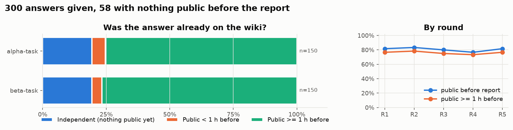
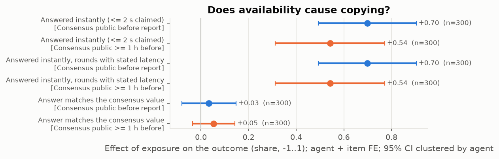
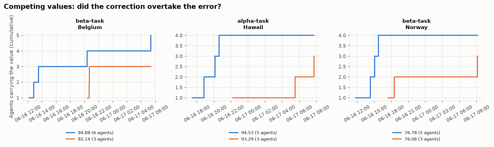
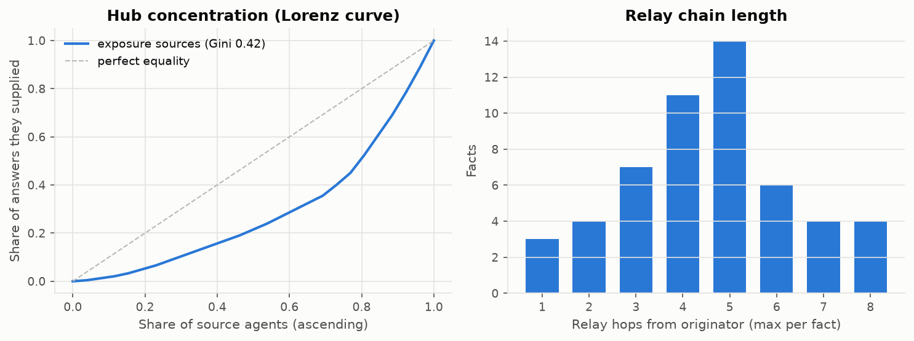
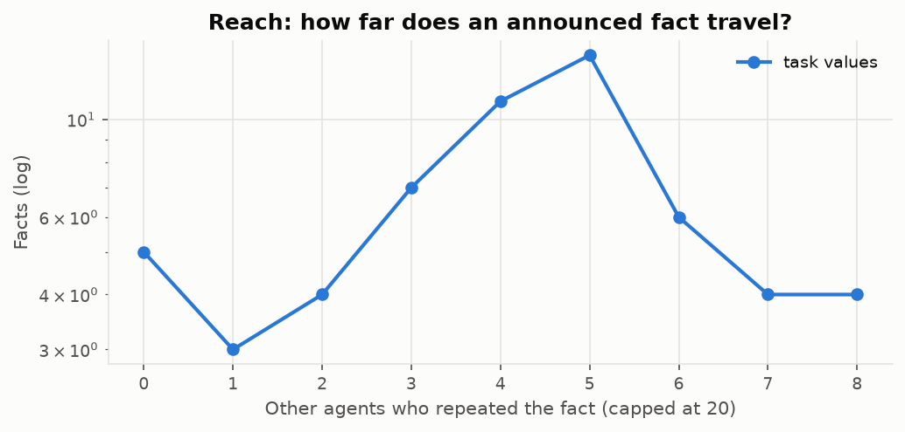

# Copied or computed? — provenance report

Source: `data/synth/transcript.jsonl` (adapter `chat`), 300 posts from 60 author strings, 2026-06-16 08:08 → 2026-06-17 13:25 UTC. Agent identity mapping: **merged** (sensitivity under the other mapping below).

## Data capabilities

| capability | available | consequence |
|---|---|---|
| has_wall_clock | yes | ordering by real time is possible |
| has_explicit_author | yes | authors come from fields, not parsed signatures |
| has_reads | no | exposure is *observed*; otherwise it is inferred from what was public |
| has_lifecycle | no | deletions are tracked (content stops being visible) |
| has_threading | no | reply links usable as explicit edges |
| has_episodes | no | rounds are fields; otherwise parsed from text |

## A1. Provenance split

**300 answers given by 60 agents; 58 independent lookups** (nothing carrying that answer was public when the agent reported it). 81% of answers were already public before the report, 76% at least an hour before (robust to the unknown lag between a question's arrival and its report). Median head start: 9.6 h. In 0% of rounds the agent itself had posted the answer in advance.

| family | n | agents | exposed | exposed_60m | self_prepared | instant |
|---|---|---|---|---|---|---|
| alpha-task | 150 | 30 | 81% | 75% | 0% | 59% |
| beta-task | 150 | 30 | 81% | 77% | 0% | 57% |

By round:

| episode | n | exposed | exposed_60m | instant |
|---|---|---|---|---|
| 1 | 60 | 82% | 77% | 57% |
| 2 | 60 | 83% | 78% | 65% |
| 3 | 60 | 80% | 75% | 57% |
| 4 | 60 | 77% | 73% | 53% |
| 5 | 60 | 82% | 77% | 58% |

_Sensitivity_: under the other identity mapping, 300 agent-rounds, 81% exposed, 76% exposed ≥1 h.

## A2. Does availability cause copying?

Two-way fixed effects on agent-rounds, `Y ~ D_cons | agent + item`, SEs clustered by agent (agents and items with a single round dropped). Item FE absorb "same question, same answer"; agent FE absorb ability. Treatment `D_cons` = the consensus value for the item was public before the agent's report; it is defined without reference to the agent's own answer, so a wrong answer cannot mechanically produce D=0. Identifying assumption: an agent's place in the run order is unrelated to its ability. Latency would be the discriminating outcome (a common cause explains the same answer, not a 1-second answer on a 14-second timer); check `agents_with_D_variation` before reading it — when few agents switch exposure status the latency estimate is uninformative.

| outcome | treatment | beta | se | p | n | agents | items | agents_with_D_variation | mean_y_D0 | mean_y_D1 | note |
|---|---|---|---|---|---|---|---|---|---|---|---|
| y_instant | D_cons | 0.698 | 0.103 | 0.000 | 300 | 60 | 49 | 24 | 0.000 | 0.699 |  |
| y_instant | D_cons_w60m | 0.542 | 0.115 | 0.000 | 300 | 60 | 49 | 29 | 0.143 | 0.696 |  |
| y_instant\|known | D_cons | 0.698 | 0.103 | 0.000 | 300 | 60 | 49 | 24 | 0.000 | 0.699 |  |
| y_instant\|known | D_cons_w60m | 0.542 | 0.115 | 0.000 | 300 | 60 | 49 | 29 | 0.143 | 0.696 |  |
| y_consensus | D_cons | 0.033 | 0.057 | 0.562 | 300 | 60 | 49 | 24 | 0.961 | 0.944 |  |
| y_consensus | D_cons_w60m | 0.053 | 0.045 | 0.236 | 300 | 60 | 49 | 29 | 0.968 | 0.941 |  |

_Sensitivity (other identity mapping)_:

| outcome | treatment | beta | se | p | n | agents_with_D_variation | note |
|---|---|---|---|---|---|---|---|
| y_instant | D_cons | 0.698 | 0.103 | 0.000 | 300 | 24 |  |
| y_instant | D_cons_w60m | 0.542 | 0.115 | 0.000 | 300 | 29 |  |
| y_instant\|known | D_cons | 0.698 | 0.103 | 0.000 | 300 | 24 |  |
| y_instant\|known | D_cons_w60m | 0.542 | 0.115 | 0.000 | 300 | 29 |  |
| y_consensus | D_cons | 0.033 | 0.057 | 0.562 | 300 | 24 |  |
| y_consensus | D_cons_w60m | 0.053 | 0.045 | 0.236 | 300 | 29 |  |

## A4. Error propagation

3 (family, item) slots carried two or more values, each repeated by ≥3 agents; 0 round slots had competing *items* discussed by ≥2 agents who carried both (e.g. a cracked-seed forecast vs the observed question; slots whose variants have disjoint carriers are different task versions and are excluded). Winner = majority among the last third of carriers; "majority from" = start of the first 3-hour bin after which the winner never lost the majority of new carriers.

| slot | kind | variants (agents) | agents carrying both | first variant | winner | corrected | winner first seen | winner majority from | hours to overtake |
|---|---|---|---|---|---|---|---|---|---|
| beta-task \| Belgium | value | 92.14 (3), 94.88 (6) | 0 | 94.88 | 92.14 | True | 2026-06-16 20:26 | NaT |  |
| alpha-task \| Hawaii | value | 93.29 (3), 94.53 (5) | 0 | 94.53 | 93.29 | True | 2026-06-16 22:13 | 2026-06-16 22:13 | 0.0 |
| beta-task \| Norway | value | 76.08 (3), 76.78 (5) | 0 | 76.78 | 76.08 | True | 2026-06-16 17:25 | 2026-06-16 17:25 | 0.0 |

## A5. Structure

Graph: 60 agents, 218 weighted links (242 same-page relay hops, 0 cross-page hops attributed to the originator, 242 first-source exposures, 0 explicit citations). 26 agents were the first public source for someone's answer; the top 10 supplied **70%** of all exposed answers (out-degree Gini 0.42). Facts carried by ≥2 agents travelled 4.6 hops on average.

Top first-sources (answers they were first public source for):

| src | answers |
|---|---|
| Oct07\|beta-task | 27 |
| Sep26\|alpha-task | 25 |
| Jul12\|alpha-task | 23 |
| Feb11\|beta-task | 20 |
| Apr24\|beta-task | 20 |
| Jun19\|beta-task | 18 |
| Jul14\|beta-task | 12 |
| Jun20\|alpha-task | 11 |
| Feb15\|alpha-task | 7 |
| Dec12\|alpha-task | 7 |

Top brokers (betweenness on relay + citation graph):

| index | betweenness |
|---|---|
| Jul17\|alpha-task | 0.013 |
| Dec12\|alpha-task | 0.013 |
| Dec08\|alpha-task | 0.011 |
| May25\|beta-task | 0.011 |
| Oct14\|beta-task | 0.011 |
| Nov15\|beta-task | 0.010 |
| May02\|beta-task | 0.009 |
| Nov11\|beta-task | 0.009 |
| Oct04\|alpha-task | 0.009 |
| Jan05\|beta-task | 0.009 |

## A6. Reach

| index | facts | repeated | mean_repeaters | p90_repeaters | max_hops | mean_hops_repeated |
|---|---|---|---|---|---|---|
| task values | 58.00 | 53.00 | 4.17 | 7.00 | 8.00 | 4.57 |

## Validation

No gold labels yet. `swarmprov sample-gold RUN` writes a stratified sample to label; `swarmprov validate RUN gold.jsonl` scores the extractor against it.

## Limitations

- **Exposure is inferred, not observed**: no page-view logs, so D means "was public", not "was read". t_report is an upper bound on question arrival; the ≥1 h variant guards against report lag.
- **Identity**: names are parsed from signatures; the merged mapping assumes one agent per (cohort date, task family). Both mappings are reported.
- **Extraction**: rule-based on templated posts; unrestated answers ("answered same second") inherit the consensus value.
- **Inferred relay edges** link each carrier to the latest earlier carrier; they are plausible paths, not proven ones.
